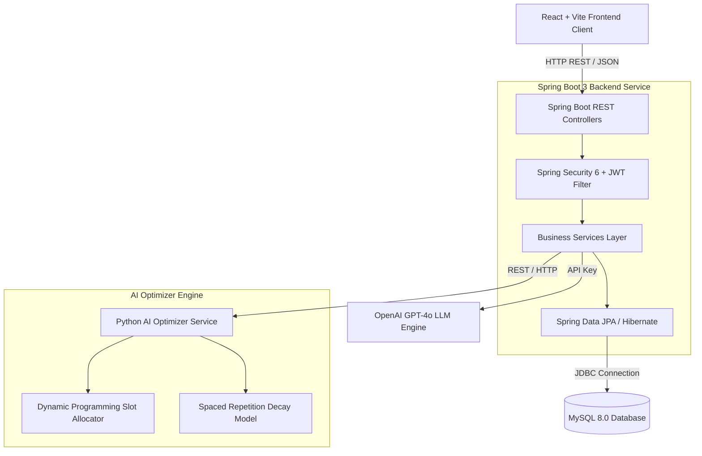

# System Architecture Diagram

```mermaid
graph TD
    Client[React + Vite Frontend Client] -->|HTTP REST / JSON| Gateway[Spring Boot REST Controllers]
    
    subgraph Spring Boot 3 Backend Service
        Gateway --> Security[Spring Security 6 + JWT Filter]
        Security --> ServiceLayer[Business Services Layer]
        ServiceLayer --> JPA[Spring Data JPA / Hibernate]
    end

    JPA -->|JDBC Connection| MySQL[(MySQL 8.0 Database)]
    
    ServiceLayer -->|REST / HTTP| PythonAI[Python AI Optimizer Service]
    ServiceLayer -->|API Key| OpenAI[OpenAI GPT-4o LLM Engine]

    subgraph AI Optimizer Engine
        PythonAI --> DP[Dynamic Programming Slot Allocator]
        PythonAI --> SR[Spaced Repetition Decay Model]
    end
```
