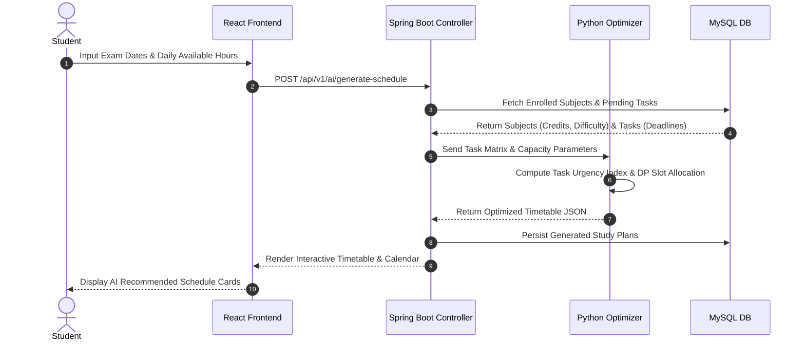

# System Workflow Diagram

```mermaid
sequenceDiagram
    autonumber
    actor Student
    participant UI as React Frontend
    participant API as Spring Boot Controller
    participant AI as Python Optimizer
    participant DB as MySQL DB

    Student->>UI: Input Exam Dates & Daily Available Hours
    UI->>API: POST /api/v1/ai/generate-schedule
    API->>DB: Fetch Enrolled Subjects & Pending Tasks
    DB-->>API: Return Subjects (Credits, Difficulty) & Tasks (Deadlines)
    API->>AI: Send Task Matrix & Capacity Parameters
    AI->>AI: Compute Task Urgency Index & DP Slot Allocation
    AI-->>API: Return Optimized Timetable JSON
    API->>DB: Persist Generated Study Plans
    API-->>UI: Render Interactive Timetable & Calendar
    UI-->>Student: Display AI Recommended Schedule Cards
```
